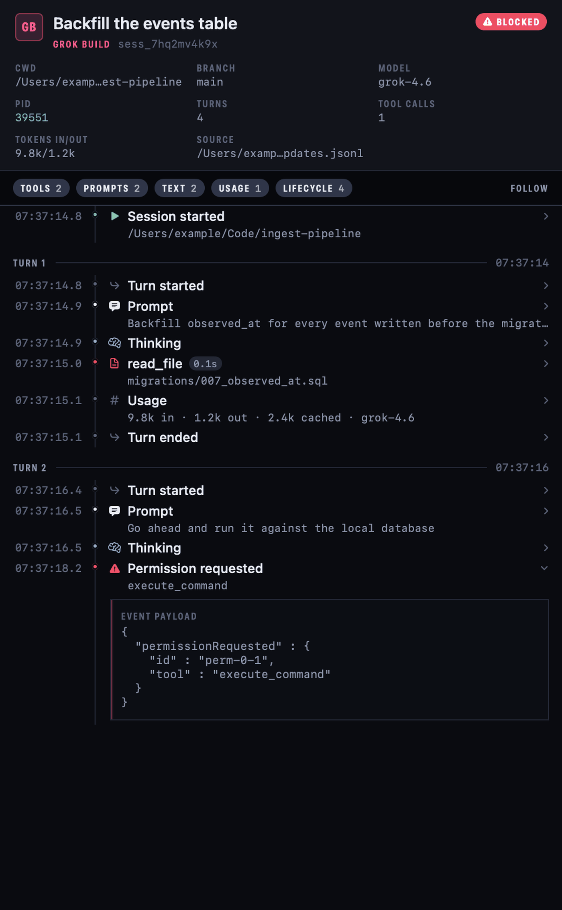
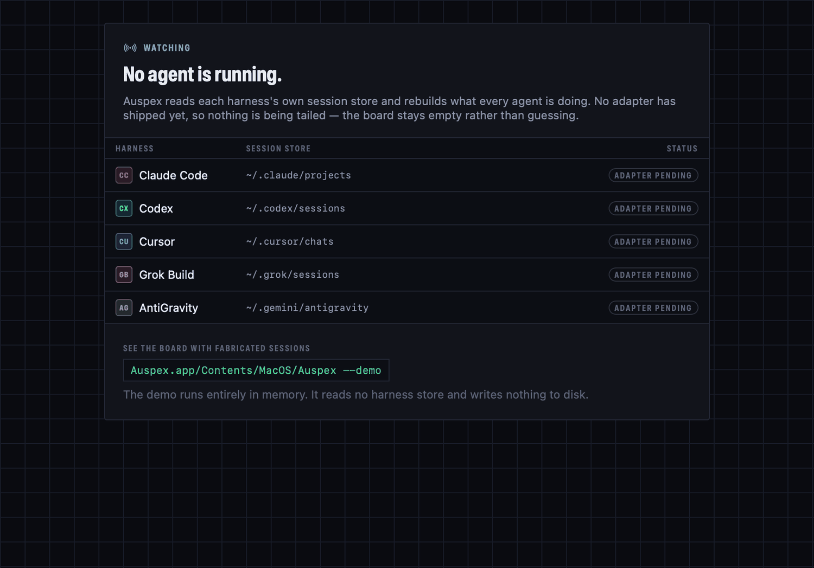
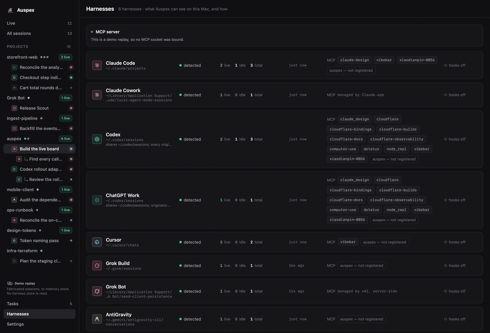

# Auspex

<p align="center">
  <strong>One live board for every AI coding agent running on your Mac.</strong>
</p>

<p align="center">
  
  
  
  <a href="LICENSE"></a>
  · <a href="README.zh-CN.md">中文</a>
</p>

Auspex watches every AI coding agent running on your Mac — Claude Code, Claude
Cowork, Codex, ChatGPT Work, Cursor, Grok Build, AntiGravity — in one live
board: who is thinking, calling tools, delegating to sub-agents, writing files,
or waiting for permission. Group sessions by project and task; expose a task
board over MCP.

> **Status: pre-alpha, private development.** The board, the session trace, and
> the menu bar are built and running against the live pipeline, but no harness
> adapter has shipped yet, so on a real machine the board is still empty. Run
> [the demo](#see-the-board) to see it working — see [Roadmap](#roadmap) for
> what lands when.


## Why

Running four or five agent harnesses at once means four or five terminal tabs,
none of which can tell you which agent is blocked on a permission prompt, which
one has been thinking for six minutes, or which two are editing the same file.
Each harness already writes a detailed session log to disk. Auspex reads all of
them and puts the answer in one window.

## Requirements

- macOS 26 (Tahoe) or newer, Apple silicon
- Xcode 26 / Swift 6.2 or newer

## Build

Auspex is a plain Swift package with no Xcode project.

```sh
swift build
swift test
```

To produce a runnable, ad-hoc-signed application bundle:

```sh
./Scripts/build_app.sh release   # or: debug
open .build/Auspex.app
```

`AUSPEX_CODESIGN_IDENTITY` overrides ad-hoc signing with a Developer ID
Application identity and enables the hardened runtime.

## See the Board

No harness adapter has shipped yet, so a real launch shows the empty board and
the list of stores it will watch. `--demo` replays a fabricated one instead:
ten sessions across all seven harnesses, walking through prompts, tool calls,
a sub-agent, a permission prompt, and a couple of endings, on a loop.

```sh
./Scripts/build_app.sh debug
.build/Auspex.app/Contents/MacOS/Auspex --demo
```

`open -a` cannot pass arguments through, so run the binary directly — or set
`AUSPEX_DEMO=1` in the environment, which does the same thing.

The demo runs entirely in memory. It opens no harness store, creates no
`~/.auspex/`, and writes nothing to disk. Every path in it is under
`/Users/example`.

| | |
| --- | --- |
|  |  |
| **Session trace** — every event in one session, grouped by turn, with tool calls collapsed to one row carrying their duration. Click a row for the payload. | **Empty board** — what a real launch shows today: the stores Auspex will read, and which adapters exist yet. |

The board is dark-first and follows the system appearance
([light mode](docs/screenshots/board-light.png)).

## Scene view

The same board, read as a room. Every live session is a little person at a
desk; every project is a room they share; a sub-agent sits at a smaller desk
beside the agent that spawned it, with a dotted line back to it. Switch with
the **Board / Scene** control above the grid.


It exists because the two views answer different questions. The wall of cards
answers *what is this session doing* precisely — tool name, target file,
elapsed, tokens. The office answers *what is the whole machine doing* without
being read at all: the loudest channel is light, so a monitor's colour is its
session's state and its rhythm is that state's motion, and the spill lands on
the desk and the agent. Six rooms of lighting resolve as a pattern before any
shape does.

| State | The desk | The agent |
| --- | --- | --- |
| Thinking | screen breathes, blue | head bobs |
| Tool call | screen flickers, amber | hands alternate, fast |
| Writing a file | steady green, paper on the desk | hands alternate, half speed |
| Delegating | steady violet, the tether pulses | stands, holds a note toward the sub-agent |
| Waiting for permission | strobes red | hand up, red `!` bubble |
| Idle | dim | slumped, still |
| Stale | dim | `zzz` |
| Ended | dark | the agent leaves, the desk stays |

Exactly one of those is allowed to shout, and it is the one that will never
resolve itself without a person.

Scroll to pan, pinch or ⌘-scroll to zoom, **Fit** to frame everything. Click a
desk to fill the trace inspector — the same selection clicking a card makes, in
both directions. Hover for a nameplate; double-click to centre. Under Reduce
Motion every rhythm collapses to a static pose. A session keeps its desk for as
long as it is on the board, so nothing moves under the pointer; when it goes,
the desk stays empty until something else takes it.

The people are placeholders drawn in code, not art. Real sprites drop in per
harness and per pose without a rebuild — [`docs/SPRITES.md`](docs/SPRITES.md)
is the specification.
## Projects and Trees

Two questions cut across a board that no harness records: **where** a session is
working, and **who** started it. Auspex answers both by looking at the machine —
git's own files for the first, the process table for the second — and puts the
answers in the sidebar and on the wall.


- **The sidebar** lists every project on the board, with a dot per harness at
  work in it and a count of what is running. Three worktrees of one repository
  are one project with three checkouts, and an agent worktree is labelled with
  its task rather than its path. Clicking a project filters the wall to it.
- **Group by: Tree** turns the wall into the delegation forest. A session that
  spawned others gets its own section with its children nested under it; a
  child card carries a chip naming its parent, and clicking the chip opens it.
- **The trace header** says how a parent link was established — a spawn the
  parent's own log recorded, an inherited environment variable, a process
  ancestry, or a person's own decision — because those are claims of very
  different strength.

## Harnesses



Seven harnesses are first-class — each gets a row, an accent, and its vendor's
own mark, and each is named in full everywhere it appears. Auspex never
abbreviates one.

| Harness | Vendor | Store Auspex reads |
| --- | --- | --- |
| Claude Code | Anthropic | `~/.claude/projects`, `~/.config/claude/projects` |
| Claude Cowork | Anthropic | `~/Library/Application Support/Claude/local-agent-mode-sessions` |
| Codex | OpenAI | `~/.codex/sessions` — every originator but ChatGPT Work |
| ChatGPT Work | OpenAI | the same tree, `originator` = ChatGPT Work |
| Cursor | Anysphere | `~/.cursor/chats` |
| Grok Build | xAI | `~/.grok/sessions` |
| AntiGravity | Google | `~/.gemini/antigravity` |

Two pairs share a vendor mark, because they share a vendor: Claude Code with
Claude Cowork, Codex with ChatGPT Work. They are told apart by their accent and
by their full name, never by a modified logo. Gemini CLI is recognised but not
featured — it is deprecated, and Auspex has no live adapter for it.

The Harnesses page answers *why is this harness not on my board* and *what can
it reach*: whether its store exists on this Mac, how many of its sessions are
live, when it last did anything, and which MCP servers it has been configured
with. Every file behind that page is read and never written — including the
configuration files, which Auspex parses for server names and nothing else.

## How Data Is Collected

Auspex is a **read-only observer of local files**.

- Each supported harness already records its sessions somewhere under your home
  directory — JSONL transcripts, SQLite stores, conversation databases. Auspex
  tails those files and reconstructs a session state machine from them.
- **Every harness store is treated as read-only.** Auspex never writes into
  another tool's directory, never deletes a session, and never modifies a
  transcript.
- **Everything Auspex writes goes under `~/.auspex/`** (mode 0700), routed
  through a single `AuspexPaths` type so the write scope is auditable by
  reading one file.
- **No network.** Auspex has no backend, no telemetry, no analytics, and no
  update service. Nothing leaves your machine.
- Optional harness hooks (M3) are opt-in and local: they notify the running app
  over a Unix socket at `~/.auspex/mcp.sock` so state updates land instantly
  instead of on the next file poll.

Auspex runs **without the macOS app sandbox**, because a sandboxed app cannot
read across the harness directories it exists to observe. That is a deliberate
trade-off, not an oversight, and it is not a license for casual filesystem
access — see [`AGENTS.md`](AGENTS.md).

## Privacy

Agent transcripts are some of the most sensitive text on a developer's machine:
they contain source code, infrastructure details, and whatever was pasted into
a prompt at 2am. Auspex treats them accordingly.

- Session content stays local, in a SQLite database under `~/.auspex/`.
- Process command lines are sanitized before they are logged or stored — some
  harnesses pass credentials in argv (`cursor-agent --api-key …`).
- Nothing is uploaded, and there is no opt-out telemetry to disable, because
  there is no telemetry.
- The repository is public: no real tokens, org IDs, account IDs, email
  addresses, or `/Users/<name>` paths belong in source, fixtures, or logs.

## Roadmap

| Milestone | Scope |
| --------- | ----- |
| **M0** | Repository skeleton and the shared `agent-session-kit` package: session model, event stream, source-adapter protocol. |
| **M1** | Live board for Claude Code and Codex — running / thinking / tool call / waiting-for-permission / idle, updating in real time. *The board, the trace inspector, and the menu bar are in; the two adapters are landing.* |
| **M2** | All seven harnesses, plus project and task grouping and the pixel scene view. |
| **M3** | MCP task board over `~/.auspex/mcp.sock` (with an `--mcp-stdio` bridge) and opt-in harness hooks for instant updates. |
| **M4** | Control — act on a session from Auspex, not just watch it. |

## Architecture

[`docs/ARCHITECTURE.md`](docs/ARCHITECTURE.md) describes the target design:
source adapters, the event stream and state reducer, the session registry, the
GRDB store, and the MCP surface. Most of it is not implemented yet.

## Contributing

See [`CONTRIBUTING.md`](CONTRIBUTING.md) for the branch and PR workflow and the
privacy rules, and [`AGENTS.md`](AGENTS.md) for the full operating manual —
including the conventions AI agents working in this repository must follow.

Security reports: [`SECURITY.md`](SECURITY.md).

## License

AGPL-3.0-only. Copyright © 2026 AstroQore. See [`LICENSE`](LICENSE).
