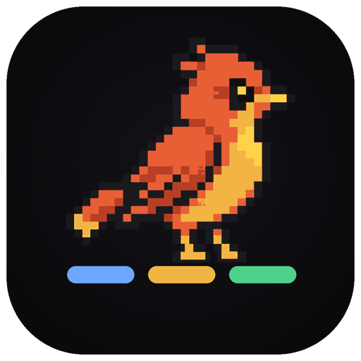
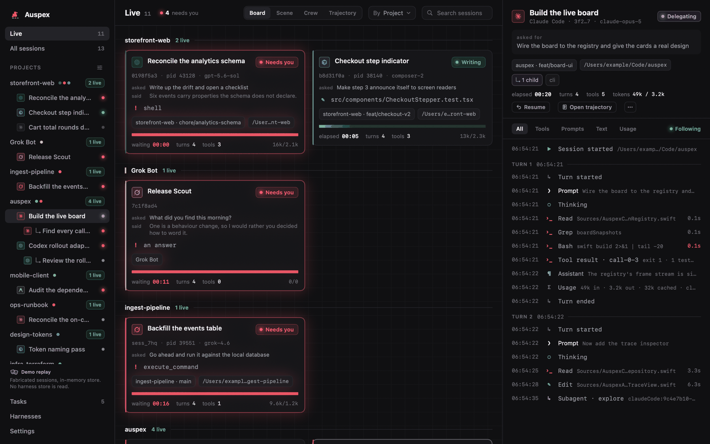
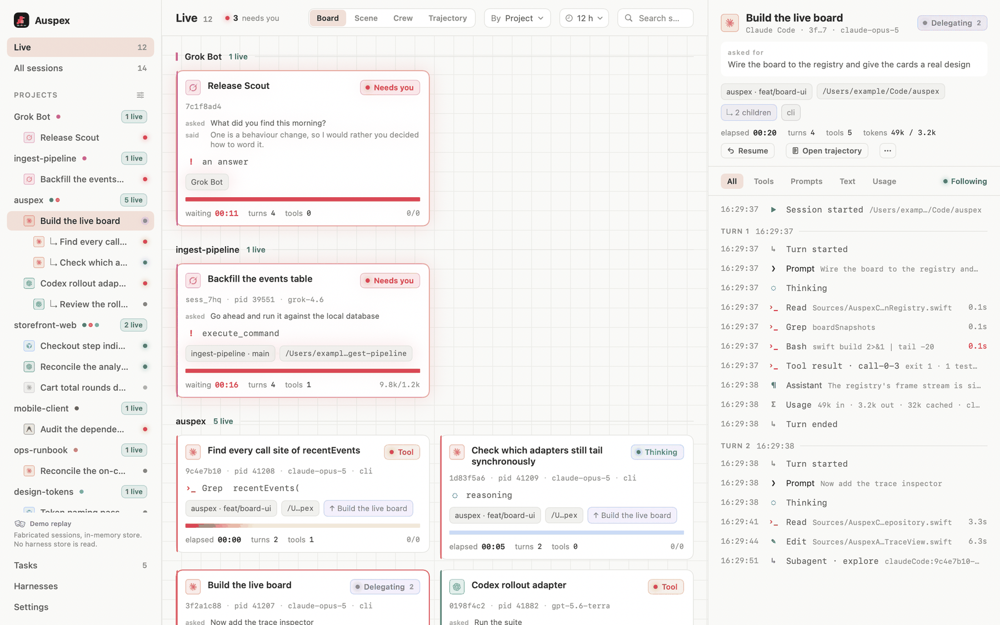
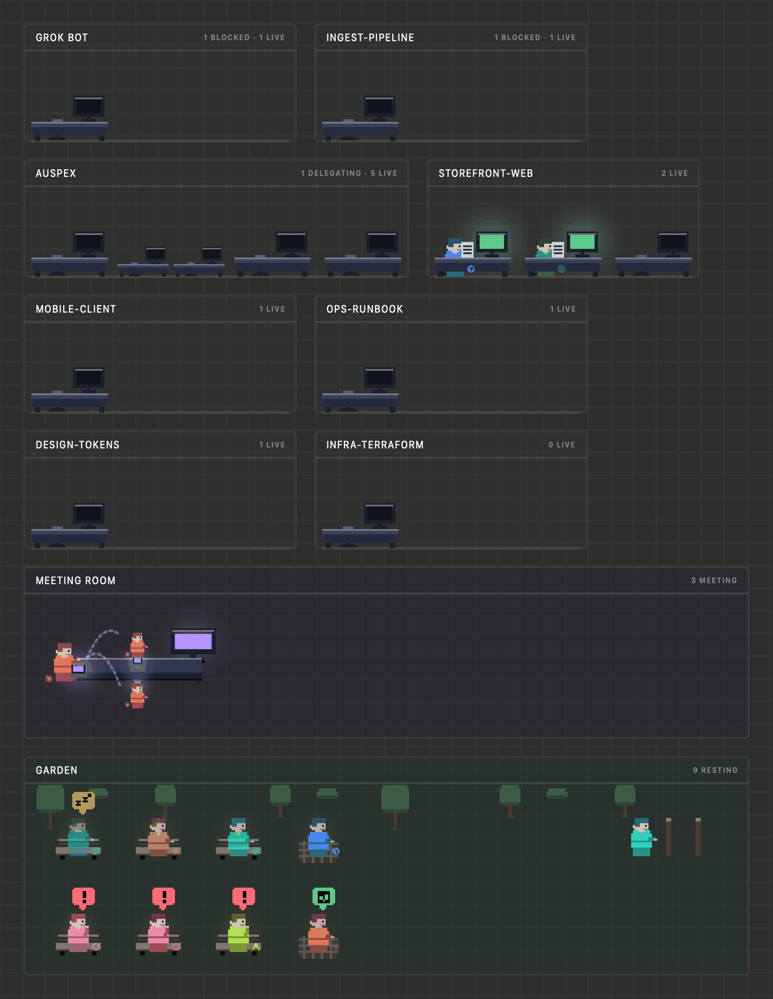
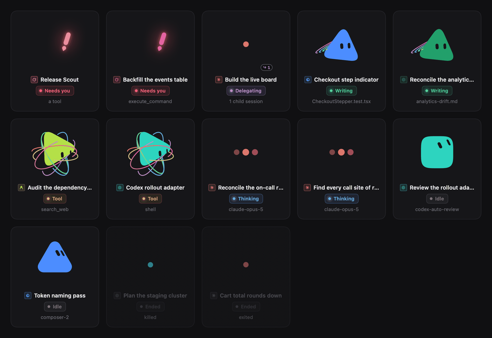
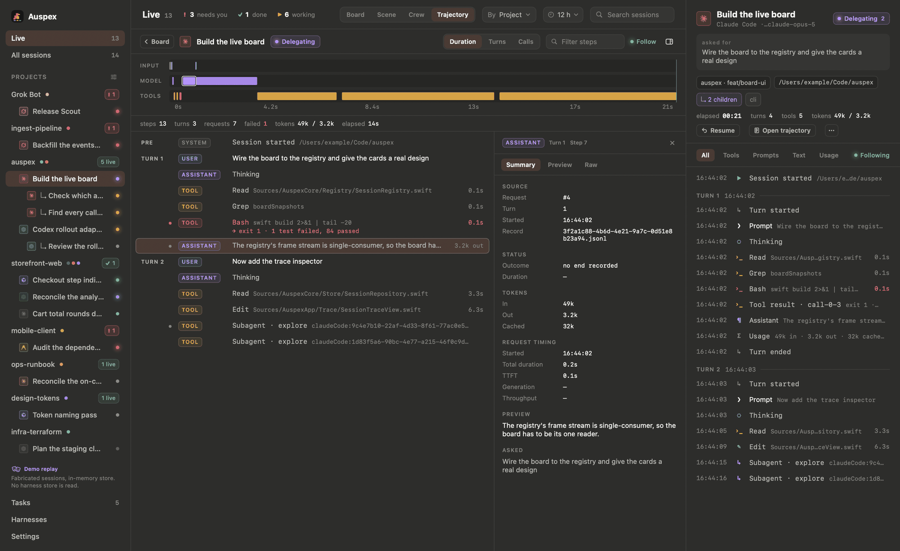
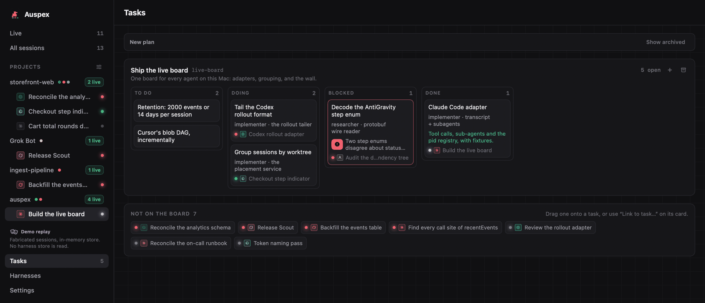
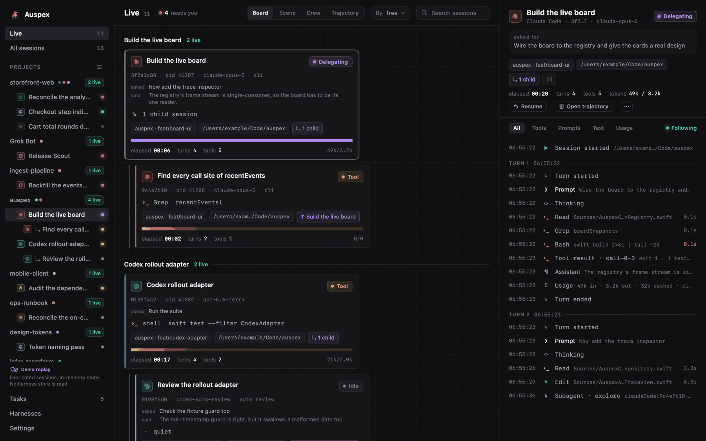

<p align="center">
  
</p>

<h1 align="center">Auspex</h1>

<p align="center">
  <strong>One live board for every AI coding agent running on your Mac.</strong>
</p>

<p align="center">
  <a href="https://github.com/AstroQore/auspex/actions/workflows/ci.yml"></a>
  <a href="https://github.com/AstroQore/auspex/releases/latest"></a>
  
  
  
  <a href="LICENSE"></a>
</p>

<p align="center">
  <a href="https://github.com/AstroQore/auspex/releases"><strong>Download</strong></a>
  · <a href="#build-and-run">Build from source</a>
  · <a href="#acknowledgements">Acknowledgements</a>
  · <a href="README.zh-CN.md">中文</a>
</p>

Auspex watches every AI coding agent running on your Mac — Claude Code, Claude
Cowork, Codex, ChatGPT Work, Cursor, Grok Build, Grok Bot, AntiGravity — and
puts them on one live board: who is thinking, calling tools, delegating to
sub-agents, writing files, or waiting for permission. Sessions group by project
and by who spawned them, and a shared task board is exposed over MCP so the
agents themselves can say what they need.

> **Status: pre-alpha.** It runs, it tails the real stores, and it is used
> daily by its author. There is no published release yet and no notarized
> build, and no upgrade path between versions — the database schema still
> changes. The release and in-app update machinery exists (`RELEASING.md`);
> nothing has been cut through it. So the Download link above is a promise,
> and today the answer is two commands:
>
> ```sh
> git clone https://github.com/AstroQore/auspex.git && cd auspex
> ./Scripts/build_app.sh release && open .build/Auspex.app
> ```



<details>
<summary>The same Ledger in the light appearance</summary>



</details>

## Why

Running four or five agent harnesses at once means four or five terminal tabs,
none of which can tell you which agent is blocked on a permission prompt, which
one has been thinking for six minutes, which two are editing the same file, or
which one said it finished twenty minutes ago and is waiting to be read.
Each harness already writes a detailed session log to disk. Auspex reads all of
them and puts the answer in one window.

## Requirements

- macOS 26 (Tahoe) or newer, Apple silicon
- Xcode 26 / Swift 6.2 or newer

## Build and run

Auspex is a plain Swift package with no Xcode project.

```sh
swift build
swift test
./Scripts/build_app.sh release   # or: debug
open .build/Auspex.app
```

`AUSPEX_CODESIGN_IDENTITY` overrides ad-hoc signing with a Developer ID
Application identity and enables the hardened runtime.

`--demo` replays a fabricated board instead of tailing the real stores — a
dozen sessions across all eight harnesses, walking through prompts, tool calls,
a sub-agent, a permission prompt, an agent calling for a person, and a couple
of endings, on a loop. It runs entirely in memory: no harness store is opened, no
`~/.auspex/` is created, nothing is written to disk, and every path in it is
under `/Users/example`.

```sh
.build/Auspex.app/Contents/MacOS/Auspex --demo
```

`open -a` cannot pass arguments through, so run the binary directly — or set
`AUSPEX_DEMO=1`, which does the same thing. Every screenshot in this README is
rendered from that demo board by the app itself (`--render-board`,
`--render-scene`, `--render-crew`, `--render-trajectory`), so none of them
carries a real session, a real path, or a real name.

## Download and update

Tagged builds are published as GitHub Releases, and a build installed from one
keeps itself current: **Settings → Updates**, or **Auspex → Check for
Updates…**. Auspex checks once a day and never installs anything without being
asked — this is a window people leave open for days, and an app that replaced
itself under a running session would take the session's window with it.

There are two streams, and you choose which one this copy follows:

| | |
| --- | --- |
| **Stable** | Released versions only. This is the one to be on. |
| **Dev** | Preview builds cut between releases, **plus** every stable release. |

Dev is additive on purpose: trying a preview never means missing the next
stable fix. Every build in the feed is signed with the project's EdDSA key and
verified against the key compiled into your copy *before* a byte is unpacked,
so a download tampered with in transit is refused rather than run. That check
is independent of Apple's, which matters while the builds are ad-hoc signed —
Gatekeeper will ask you to approve the first launch by hand.

The choice is written to `~/.auspex/settings.json` like every other setting, so
you can read it, change it, or undo it without the app.

> **Pre-alpha, so this is not live yet.** The update feed lives on a public
> branch of this repository, and there is no published release to point it at
> today. Build from source (above) until there is; `RELEASING.md` describes how
> a release is cut, signed, and published.

## It follows your Mac

Every colour has a value for each appearance — the same four surface steps, the
same three text steps, one colour per state and one per harness, with only
their brightness moved — so the board is the same board in either. Auspex
follows whatever your Mac is set to, including a scheduled switch at sunset.
The light twin of the board above is folded into the hero at the top of this
page.

**Settings → Appearance** overrides that with Light or Dark, switches the
sidebar between the system's own material and the board's flat ground, and
shows you which accent, background and foreground the choice resolved to.
Nothing is relaunched: the window, the menu bar panel, the Aviary and the
Flock all repaint where they stand. `--appearance light|dark` does the same
for one launch without writing it down, which is how the performance budget is
measured against both.

Every screenshot below has a `-light` twin in `docs/screenshots/`, rendered by
the same command with `appearance=light` on the end.

## Four ways to read one board

The picker in the header switches how the live sessions are drawn. It is a mode
rather than a destination: the selection, the grouping, the filters and the
trace beside them all survive a switch.

**Ledger** (was Board) is the wall of cards — the only view that shows
everything at once, and the one that answers *what is this session doing*
precisely: state, tool name, target file, elapsed, tokens, what it was asked
to do, what it last said.

**Aviary** (was Scene) is the same board as a place. Every session is a
person, every project is a room, and *where somebody is* is the first thing a
glance reads: working sessions sit at their desks, a delegating session walks
to the meeting room with the sub-agents it spawned around a long table, idle
ones rest on a garden bench — the ones that finished something you have not
looked at hold a note — and an ended session walks out through the gate. The
loudest channel is light: a monitor's colour is its session's state and its
rhythm is that state's motion.



The canvas is a real `NSScrollView`, so two fingers pan and pinch at once the
way they do in Preview, with the same momentum and the same elastic edges;
⌘-scroll zooms, a two-finger double tap frames the room under the pointer, and
**Fit** (⌘0) frames everything. Clicking a desk fills the trace inspector, the
same selection clicking a card makes. Under Reduce Motion every rhythm
collapses to a static pose.

| State | The desk | The agent |
| --- | --- | --- |
| Thinking | screen breathes, blue | head bobs |
| Tool call | screen flickers, amber | hands alternate, fast |
| Writing a file | steady green, paper on the desk | hands alternate, half speed |
| Delegating | steady violet, the tether pulses | stands, holds a note out |
| Idle · Stale · Ended | dim · dim · dark | slumped · `zzz` · walks out the gate |

Exactly one thing is allowed to shout, and it is the one that will never
resolve itself without a person — but it is not a state. See below.

| | |
| --- | --- |
|  |  |
| **Flock** (was Crew) — one geometric avatar per session, its face and posture driven by what that session is doing. The same information as the Aviary at a tenth of the pixels. | **Flight** (was Trajectory, ⌘T) — one session opened out: a waterfall of its turns, every step it took, and an inspector on whichever one is selected. |

## Two axes: what a session is doing, and whether it wants you

**Activity** is inferred, always, for every session on the machine — working,
idle, stale, ended. **Attention** is never inferred. A card is only counted as
wanting a person, or as having finished, when something *said so*: an agent
calling `auspex.notify`, a `PermissionRequest` hook, or a harness's own
permission wait.

The two are independent. An agent that reports finishing while a `swift build`
is still running is working and done at once, and both are true.

| | What puts a card here | Ledger | Aviary | Menu bar | Notification |
| --- | --- | --- | --- | --- | --- |
| **Needs you** | `notify(needs_input\|needs_review\|blocked)`, a permission hook, a harness's own wait | red ring, breathing, sorted first | front row of the garden, red `!` | `! N` | always |
| **Done** | `notify(done)`, `tasks.complete` | green ring, the agent's line | same front row, green `✓` | `✓ N` | on by default |
| **Working** | thinking, a tool, a write, sub-agents | ordinary card | desk or meeting table | `▶ N` | none |
| **Idle** | a turn closed, nothing outstanding | grey pill | garden bench, dozing if stale | — | none |
| **Ended** | the process is gone | collapsed fold | walks out the gate | — | none |

*Idle* and *ended* are the pair worth being exact about: **idle means you can
keep talking in that terminal**, and **ended means the line is gone — only
Resume brings the work back**.

A turn simply ending is none of these. It is idle, and it puts a faint dot on
the card and nothing else: on a machine that has been running agents all week
that inference is true of hundreds of sessions at once, and a count nobody can
act on takes the counts beside it down with it.

Both loud buckets clear themselves. Opening the card, typing into that
session's own terminal, the agent going back to work, "Dismiss", "Mark all as
seen", or a day going by — whichever comes first.

## The board says what agents ask for, not only what they do

Passive observation cannot answer *is this waiting for me*. Claude Code and
Cursor write no permission state to disk, and "I asked you a question and I am
waiting" is invisible in every harness's files. So Auspex runs an MCP server on
`~/.auspex/mcp.sock` and lets a session say so itself.

```jsonc
// ~/.claude.json — Settings → Harnesses writes this for you, fenced and reversible
{ "mcpServers": { "auspex": {
    "command": "/Applications/Auspex.app/Contents/MacOS/Auspex",
    "args": ["--mcp-stdio"]
} } }
```

```toml
# ~/.codex/config.toml
[mcp_servers.auspex]
command = "/Applications/Auspex.app/Contents/MacOS/Auspex"
args = ["--mcp-stdio"]
```

- **`auspex.notify(kind, message)`** — `needs_input`, `needs_review`,
  `blocked`, or `done`, with one sentence. It posts a macOS notification, moves
  the card into that bucket, and puts the agent's own words on it. It clears
  itself when the person next types into that session, opens the card, or a day
  goes by. `tasks.complete` files a `done` on its own, so a worker never has to
  say it twice.
- **`auspex.report(focus, progress)`** — replaces Auspex's inference about what
  a session is doing with the session's own sentence. Session reads return that
  persisted focus, progress, timestamp, and whether later prose superseded it.
- **`overview.get(project?)`** — the compact situation report: this session,
  Doing, Blocked, Review, unclaimed ready work, orphaned claims, and every
  session explicitly needing the person. With no argument it uses the caller's
  current project.
- **`tasks.*`** — the shared task board. **Every task belongs to a project**,
  and the project is resolved from the calling session, so an agent that files
  one never has to say where it is working: `tasks.create` lands in the same
  project the board already draws that agent's card under. A supervisor files
  one task per worker and puts the id in each brief; each worker calls
  `tasks.claim(task_id, role, scope)`, `tasks.update` when it is blocked, and
  `tasks.complete` when it is done. `tasks.get` returns a monotonic version,
  dependency readiness, attempt/history entries, pending takeover requests,
  and safe linked-session capsules. New clients return that version as
  `expected_version` on writes; old clients remain compatible. Missing,
  self-referential, or cyclic dependencies are refused without changing the
  graph. A conflicting claim becomes a human-approved takeover request rather
  than stealing work; `tasks.release` lets only the current holder give work
  back with a reason and never auto-grants a pending request.
- **`plans.*`** — milestones: an optional heading *inside* a project, for a
  decomposition worth naming. Kept under the older name so briefs already in
  flight keep working.
- **`sessions.self` / `sessions.list` / `sessions.get` / `sessions.tree` /
  `peers.status`** —
  read-only. An agent never has to know its own session id: Auspex resolves it
  from the process on the other end of the socket. `sessions.list` can be
  project-filtered; `sessions.get` returns structured metadata, task links, and
  self-reports, never raw transcript, full assistant text, argv, or tool output.

Twenty tools in all. `auspex --mcp-stdio` is a thin bridge for clients that
speak stdio — it connects to the socket and pumps bytes, and exits 1 with one
line when Auspex is not running, so the protocol is enrichment and never a
dependency. The same registration installs **hooks** where a harness has them:
`auspex --hook <harness>` forwards a lifecycle payload over the same socket and
exits 0 within 200 ms whatever happens, because a hook is a synchronous child
of a working agent and must never be able to block or veto it.

**Roost** (was Tasks) is where that board is read back: one lane per project,
the milestones inside it, and every task sorted by status with whoever claimed
it named on the card.



## Projects, trees, and the sessions you do not want to see

Two questions cut across the board that no harness records: **where** a session
is working, and **who** started it. Auspex answers both by looking at the
machine — git's own files for the first, the process table for the second.



- **The sidebar** lists every project on the board with a count of what is
  running in it. Three worktrees of one repository are one project with three
  checkouts, and an agent worktree is labelled with its task rather than its
  path. Clicking a project binds every surface to it — the wall, the tree, and
  the Aviary's camera.
- **Group by: Tree** turns the wall into the delegation forest. The trace
  header says *how* a parent link was established — a spawn the parent's own
  log recorded, an inherited environment variable, a process ancestry, or a
  person's own decision — because those are claims of very different strength.
- **Your own projects** claim folders, so six directories that are one piece of
  work read as one project whatever git says. **Ignore rules** hide a folder, a
  project, a prompt prefix, a harness, or a title substring. Ignored is not
  deleted: the header offers "N ignored", which puts them back dimmed.

## Harnesses

Eight harnesses are first-class — each gets a row, an accent, and its vendor's
own mark, and each is named in full everywhere it appears. Auspex never
abbreviates one.

| Harness | Vendor | Store Auspex reads |
| --- | --- | --- |
| Claude Code | Anthropic | `~/.claude/projects`, `~/.config/claude/projects` |
| Claude Cowork | Anthropic | `~/Library/Application Support/Claude/local-agent-mode-sessions` |
| Codex | OpenAI | `~/.codex/sessions` — every originator but ChatGPT Work |
| ChatGPT Work | OpenAI | the same tree, `originator` = ChatGPT Work |
| Cursor | Anysphere | `~/.cursor/chats` |
| Grok Build | xAI | `~/.grok/sessions` |
| Grok Bot | xAI | `~/Library/Application Support/Grok Bot/sand-client-persistence` |
| AntiGravity | Google | `~/.gemini/antigravity` |

Two pairs share a vendor mark, because they share a vendor: Claude Code with
Claude Cowork, Codex with ChatGPT Work. They are told apart by their accent and
by their full name, never by a modified logo. Gemini CLI is recognised but not
featured — it is deprecated, and Auspex has no live adapter for it.

### What Auspex can actually see, per harness

First-class does not mean equal. Auspex can only read what a harness writes
down, and they write down very different things. This table is what the
adapters do today, not what they could do.

| | Live state | Tools | Sub-agents | Permission wait | Context window | Quota | Resume |
| --- | :-: | :-: | :-: | :-: | :-: | :-: | :-: |
| **Claude Code** | ✓ | ✓ | ✓ | hook | derived | — | ✓ |
| **Claude Cowork** | ✓ | ✓ | ✓ | MCP | derived | — | — |
| **Codex** | ✓ | ✓ | ✓ | ✓ | ✓ | ✓ | ✓ |
| **ChatGPT Work** | ✓ | ✓ | ✓ | ✓ | ✓ | ✓ | ✓ |
| **Cursor** | ✓ | ✓ | hook | MCP | — | — | — |
| **Grok Build** | ✓ | ✓ | derived | ✓ | ✓ | — | ✓ |
| **Grok Bot** | derived | — | — | ✓ | — | — | — |
| **AntiGravity** | ✓ | ✓ | ✓ | ✓ | — | — | CLI only |

**✓** the harness's own store says so · **derived** Auspex works it out ·
**hook** only with the opt-in hook installed (Settings → Harnesses) ·
**MCP** only when the agent says so itself, via `auspex.notify` ·
**—** nothing on disk answers it.

`auspex.notify` reaches all eight; an **MCP** cell marks the harnesses where it
is the *only* answer.

Read down the columns rather than across the rows — each one is a different
kind of gap:

- **Live state · Tools.** Every harness but Grok Bot writes a transcript with
  tool calls in it. Grok Bot's store records a streaming flag and the text, and
  no tool name, no model, and no token counts, so its cards say *thinking* or
  *idle* and stop there honestly.
- **Sub-agents.** Claude Code, Claude Cowork, Codex and AntiGravity each record
  a link from a child session back to its parent, so the delegation tree is
  read rather than guessed. Grok Build names `spawn_subagent` as a tool but
  never names the session it created, so Auspex knows a delegation happened and
  not to whom. Cursor's links arrive only over the hook. Where none of that
  exists there is still the process table, and the trace header always says
  which kind of evidence a parent link came from — a recorded spawn, an
  inherited environment variable, process ancestry, or a person's own decision.
- **Permission wait.** Codex, Grok Build, Grok Bot and AntiGravity write it
  down. Claude Code and Cursor decide it inside their own UI and put nothing in
  the transcript until the answer arrives — which is the entire reason the MCP
  server and the hooks exist.
- **Context window · Quota.** Codex reports both, measured, from its own
  rollout. Grok Build reports context, measured. Claude Code and Claude Cowork
  report token usage that Auspex turns into a percentage against a table of
  model window sizes, which is why those cells say *derived*. **Neither column
  is drawn anywhere in the app yet** — the pipeline computes them, the cards
  show cumulative tokens, and a gauge is still to come. Listed here because the
  data is real and the surface is the missing half.
- **Resume.** `claude --resume`, `codex resume`, `grok --resume` and, for
  AntiGravity sessions started from its CLI rather than its IDE,
  `agy --conversation`. The others have nothing to resume *into*: Cursor and
  Claude Cowork own their windows, and a Grok Bot session runs server-side.

The Harnesses page answers *why is this harness not on my board* and *what can
it reach*: whether its store exists on this Mac, how many of its sessions are
live, when it last did anything, and which MCP servers and hooks it has been
configured with. Every file behind that page is read and never written.

There is no screenshot of it here on purpose. That page is a report about *this
machine* — it lists the MCP servers you personally have configured — so a
picture of it is a picture of somebody's setup, and this repository is public.
Run it and look.

## Characters

The people in the Aviary are placeholders drawn in code until art exists for
them. Real characters are folders — a manifest and one frame strip per pose —
dropped into `~/.auspex/characters/` and picked up without a rebuild or a
relaunch, one pose at a time. [`docs/CHARACTERS.md`](docs/CHARACTERS.md) is the
specification; Settings → Characters is where they are chosen per harness.

## Settings

Five panes, and every one of them writes to `~/.auspex/settings.json` and
nowhere else, so anything you can set you can also read, edit, or undo without
opening the app.

- **Appearance** — Light, Dark, or follow the Mac; the sidebar's material; and
  the three resolved colours the choice produced. Nothing relaunches.
- **Characters** — which character folder each harness wears in the Aviary and
  the Flock.
- **Harnesses** — registers Auspex's MCP server, and its hooks where a harness
  has them, into that harness's own config. Opt-in, fenced, backed up, and
  reversible; it is the one place Auspex writes outside its own directory.
- **Projects** — your own project claims, so directories that are one piece of
  work read as one project, and the ignore rules that keep the rest off the
  board.
- **Updates** — Stable or Dev, and when this copy last looked.

## How it works

Eight lines, and then the long version.

1. Every harness already writes its sessions somewhere under your home
   directory — JSONL transcripts, SQLite stores, protobuf rows.
2. One **source adapter** per harness tails those files where they are, from
   the current end, and never writes a byte back into them.
3. Each adapter turns what it reads into the same small vocabulary of
   **events** — a prompt, a tool call, a file write, a sub-agent, an ending.
4. A **reducer** folds those events into one session's state; a **registry**
   holds every live session, its project, and its parent.
5. A **frame assembler** derives the whole window's worth of rows off the main
   actor, so the UI only ever compares flat values.
6. Everything that persists goes through `AuspexPaths` into **one store under
   `~/.auspex/`** (mode 0700) — the SQLite database, the settings, the backups.
7. An **MCP server** on `~/.auspex/mcp.sock` lets a session say what inference
   cannot see and exposes safe project, task, and peer context alongside the
   shared task board.
8. **Hooks are opt-in and fenced.** Auspex writes them only when you click, only
   inside a region it owns, only after a backup, and can undo them exactly.

[`docs/ARCHITECTURE.md`](docs/ARCHITECTURE.md) is the long version — adapters,
the event stream and reducer, the registry, the frame assembler, the GRDB
store, and the MCP surface. [`RELEASING.md`](RELEASING.md) is how a build is
cut, signed and published. [`CONTRIBUTING.md`](CONTRIBUTING.md) is how to work
on it.

## How data is collected

Auspex is a **read-only observer of local files**.

- Each supported harness already records its sessions somewhere under your home
  directory — JSONL transcripts, SQLite stores, conversation databases. Auspex
  tails those files and reconstructs a session state machine from them.
- **Every harness store is read-only.** Auspex never writes into another tool's
  directory, never deletes a session, and never modifies a transcript. SQLite
  stores are opened read-only, with a live WAL expected.
- **Everything Auspex writes goes under `~/.auspex/`** (mode 0700), routed
  through a single `AuspexPaths` type so the write scope is auditable by
  reading one file.
- **One deliberate exception.** Registering Auspex's MCP server and its hooks
  with a harness means writing that harness's config. It happens only when a
  person clicks it in Settings → Harnesses, only inside a region Auspex owns —
  a `>>> auspex >>>` fence, one JSON member named `auspex`, or the hook entries
  whose command runs the Auspex binary — only after a backup into
  `~/.auspex/backups/`, is re-parsed afterwards, and can be undone exactly.
- **No network, with one exception you can see.** No backend, no telemetry,
  no analytics, no accounts, no crash reporting. Nothing about your sessions
  leaves your machine. The single outbound request Auspex makes is Sparkle
  fetching a static appcast file from this repository to ask whether a newer
  version exists — the same request you would make by opening the Releases
  page, and it carries nothing but a version number.

Auspex runs **without the macOS app sandbox**, because a sandboxed app cannot
read across the harness directories it exists to observe, and cannot bind
`~/.auspex/mcp.sock`. That is a deliberate trade-off, not an oversight, and it
is not a license for casual filesystem access — see [`AGENTS.md`](AGENTS.md).

## Privacy

Agent transcripts are some of the most sensitive text on a developer's machine:
they contain source code, infrastructure details, and whatever was pasted into
a prompt at 2am. Auspex treats them accordingly.

- Session content stays local, in a SQLite database under `~/.auspex/`.
- Process command lines are sanitized before they are logged or stored — some
  harnesses pass credentials in argv (`cursor-agent --api-key …`).
- Text an agent writes over MCP is stripped of control characters,
  bidirectional overrides and zero-width formatters before it reaches the store
  or the screen.
- Nothing is uploaded, and there is no opt-out telemetry to disable, because
  there is no telemetry.
- The repository is public: no real tokens, org IDs, account IDs, email
  addresses, or `/Users/<name>` paths belong in source, fixtures, or logs.

## Performance

Auspex runs all day beside the harnesses it watches, so its cost is a feature
rather than an afterthought. The budgets it is held to — and the measurements
behind them — are in [`AGENTS.md` § 4.1](AGENTS.md). In short: the frame the
window draws is derived off the main actor, views compare flat row values
rather than session snapshots, one clock drives every stopwatch, and nothing
animates in a view that is not on screen.

## Roadmap

| Milestone | Scope | State |
| --------- | ----- | ----- |
| **M0** | Repository skeleton and the shared `agent-session-kit` package: session model, event stream, source-adapter protocol. | done |
| **M1** | Live board for Claude Code and Codex, updating in real time, with the session trace and the menu bar. | done |
| **M2** | All eight harnesses, project and task grouping, the user's own projects and ignore rules, the Aviary and Flock views. | done |
| **M3** | MCP task board over `~/.auspex/mcp.sock`, the `--mcp-stdio` bridge, opt-in harness hooks (`--hook`), and one-click registration with each harness. | done |
| **M4** | Retention scheduling, and control — acting on a session from Auspex rather than only watching it. | next |

## Contributing

See [`CONTRIBUTING.md`](CONTRIBUTING.md) for the branch and PR workflow and the
privacy rules, and [`AGENTS.md`](AGENTS.md) for the full operating manual —
including the conventions AI agents working in this repository must follow.
Conduct: [`CODE_OF_CONDUCT.md`](CODE_OF_CONDUCT.md). Security reports:
[`SECURITY.md`](SECURITY.md).

## Acknowledgements

Very little here is a first. What follows is what was taken and from whom, in
the order it shows up on screen. Licences and copyright lines are in
[`THIRD_PARTY_NOTICES.md`](THIRD_PARTY_NOTICES.md), which this section is kept
in step with.

**Ideas and prior art**

- **[Carbon](https://github.com/chunkburst/Carbon)** (MIT) — the task-tracking
  half of Auspex. Carbon is an integrated task manager for agent projects, and
  the shape of a task row, the insistence on a review step before a task can
  close, dependencies between tasks, and provenance notes on who did what are
  all read off it. Auspex's task board is its idea with a live session board
  attached.
- **[DeepSeek Harness](https://github.com/deepseek-ai/deepseek-harness)** (MIT)
  — the Flight view. A waterfall of one session's turns laid out by source
  with an inspector on the selected step is dsh's way of showing a run, and it
  turned out to be the right way to show a session too.
- **[Pixel Agents](https://github.com/pixel-agents-hq/pixel-agents)** (MIT) —
  the pixel office. The idea that agents are people in a room, that where
  somebody is standing is information, and that a speech bubble is how a
  program asks for help, is theirs. Auspex's Aviary is a native macOS take on
  it across eight harnesses instead of a VS Code extension around one.
- **Anthropic's Agent View** — the vocabulary. *Needs input · working · done ·
  idle* is a small set of words that survives being glanced at, and Auspex uses
  it rather than inventing a fifth vocabulary for the same four states.

**Ported code and data**

- **[bloub](https://github.com/jeremy-prt/bloub)** (MIT, © 2026 Jérémy Perret)
  — the Flock avatar engine is a Swift port: the silhouettes, the eased morphs
  between them, the two-capsule eye model on a real head orientation, and the
  resting life (gaze drift, breath, lid curve, the blink at a transition's
  midpoint). Its numbers are measurements, not settings, and the port keeps
  them; where it deviates, one file says so and why.
- **[bible-strong-avatar-lab](https://github.com/smontlouis/bible-strong-avatar-lab)**
  (AGPL-3.0, © Stéphane Montlouis-Calixte) — the Flock's expressions and
  choreography are ported data: 25 calibrated expression presets, the
  per-state expression pools and blink profiles, and the 23 built-in animation
  sequences derived from them. Auspex is AGPL-3.0 as well, so the data and the
  derivation travel under the same licence. A script re-runs the port from a
  checkout, so a re-calibration upstream is a re-run rather than a re-typing.
- **[agent-session-kit](https://github.com/AstroQore/agent-session-kit)** and
  **[Vibe Bar](https://github.com/AstroQore/vibe-bar)** (AstroQore) — the
  harness adapters, the live tailing pipeline, the MCP transport and the
  release machinery were all built for Vibe Bar first, extracted into the kit,
  and are the reason Auspex could start at eight harnesses rather than one. The
  vendor marks in `ProviderIcons/` were first collected there too.

**Look**

- **Grok Bot** (xAI) — the avatar family the Flock's look descends from, via
  bloub, which measured it frame by frame off xAI's own video.
- The **pixel art and the icon set** were generated with **OpenAI Codex** from
  [`docs/ART-HANDOFF.md`](docs/ART-HANDOFF.md), which is in the repository so
  the prompts are as reviewable as the output.

**Dependencies**

- **[GRDB.swift](https://github.com/groue/GRDB.swift)** (MIT) — the local
  store.
- **[Sparkle](https://github.com/sparkle-project/Sparkle)** (MIT) — in-app
  updates, EdDSA-signed and checked before a byte is unpacked.

**And how**

Auspex was built with **Claude Code** and **Codex**, with **AntiGravity**,
**Cursor** and **Grok Build** alongside — mainly on Fable, Opus, Sol and Terra,
with Gemini and Grok as supporting models — working in git worktrees against
written briefs. Which is also why it exists: the board is what you want when
five of them are running and only one of them is stuck.

Listing a project or showing its mark is not a claim of affiliation,
sponsorship or endorsement. All names and trademarks belong to their owners.

## License

AGPL-3.0-only. Copyright © 2026 AstroQore. See [`LICENSE`](LICENSE).
